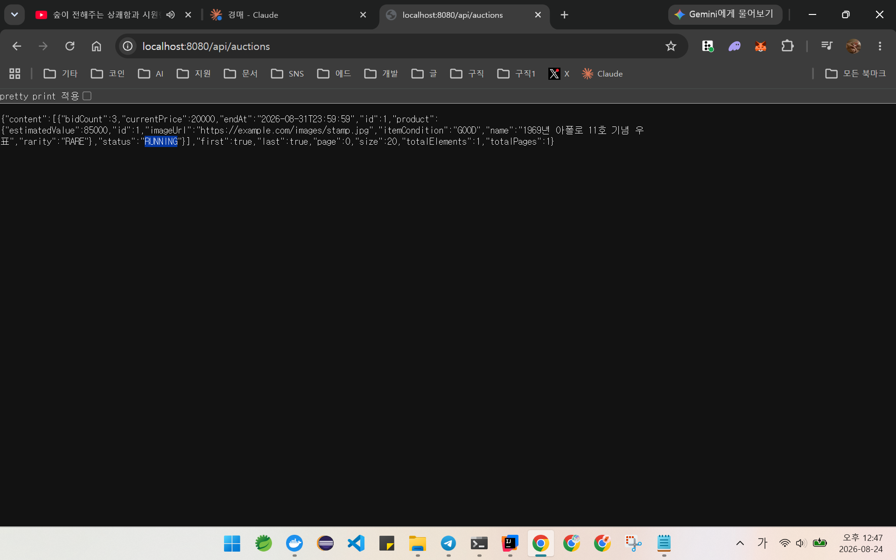
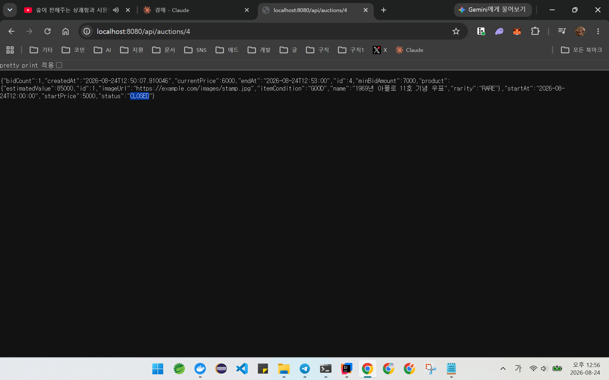
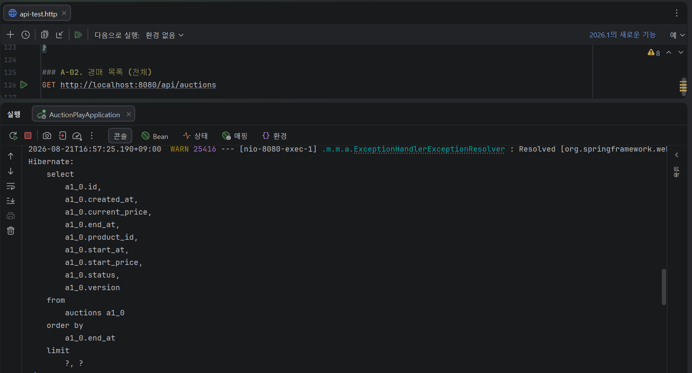
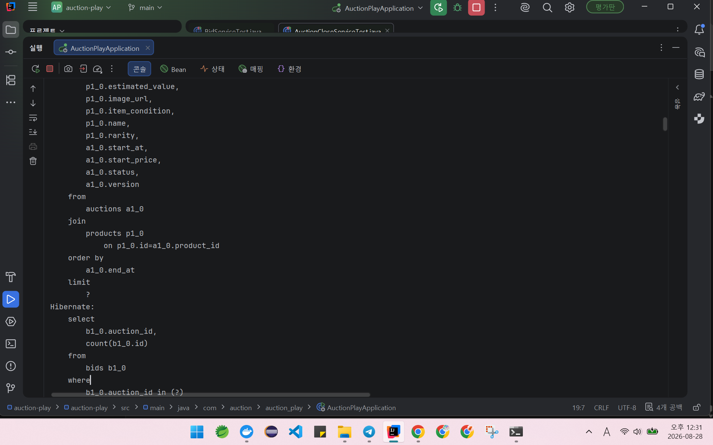
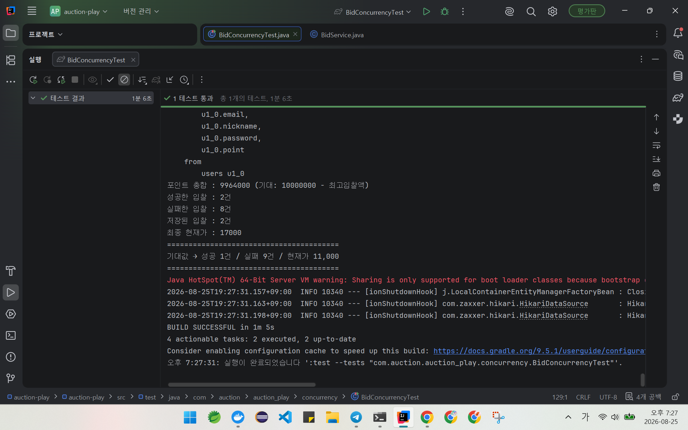
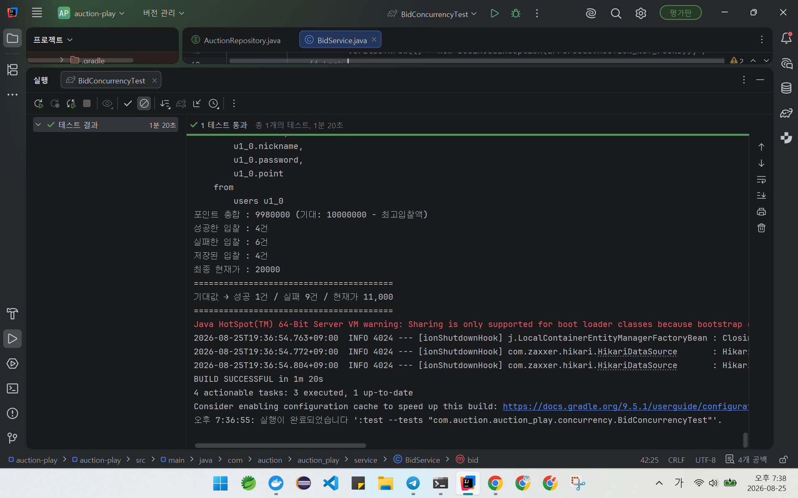
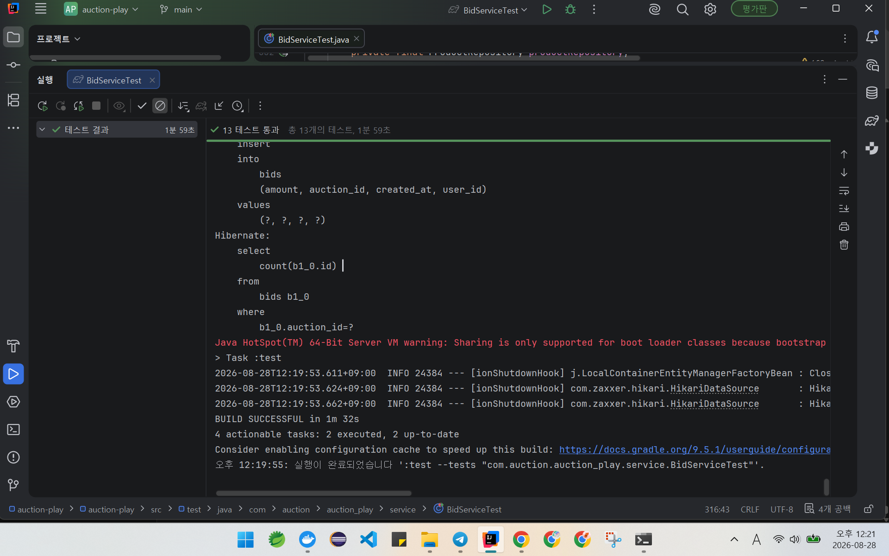
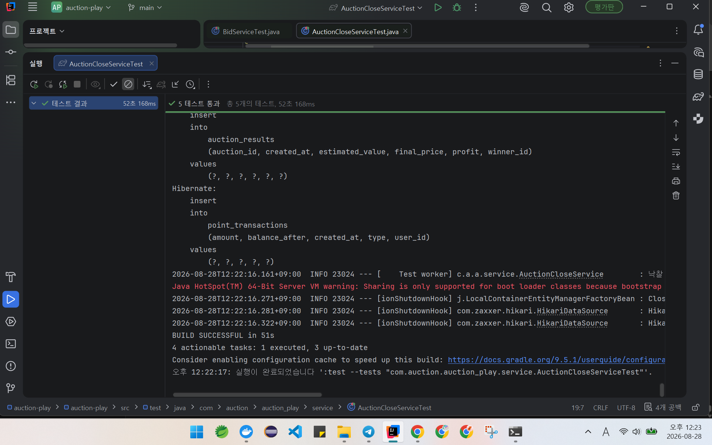

# AuctionPlay

**동시 입찰 상황에서 데이터 정합성을 보장하는 경매 백엔드**

가상 포인트로 참여하는 경매 시뮬레이터입니다.
여러 사용자가 같은 순간에 입찰해도 포인트가 새거나 늘지 않고, 시간이 지나면 시스템이 스스로 낙찰을 확정합니다.

```
포인트 총합 + 보류 금액 == 초기 총액
```

이 식이 **항상** 성립하도록 만드는 것이 이 프로젝트의 목표였습니다.

---

## 목차

1. [프로젝트 개요](#1-프로젝트-개요)
2. [기술 스택](#2-기술-스택)
3. [실행 방법](#3-실행-방법)
4. [화면 시안](#4-화면-시안)
5. [ERD](#5-erd)
6. [API 명세](#6-api-명세)
7. [핵심 기능](#7-핵심-기능)
8. [트러블슈팅](#8-트러블슈팅)
9. [테스트](#9-테스트)
10. [설계 결정](#10-설계-결정)
11. [한계와 개선 계획](#11-한계와-개선-계획)

---

## 1. 프로젝트 개요

### 무엇을 만들었나

| 항목 | 내용 |
|---|---|
| 도메인 | 가상 포인트 기반 경매 |
| 규모 | 테이블 7개 · 클래스 약 55개 · 테스트 20건 |
| 기간 | 2026.08.14 ~ 08.30 (약 28시간) |
| 인원 | 1인 |

### 왜 이 주제인가

단순 CRUD가 아니라 **거래 시스템**을 만들고 싶었습니다.

경매는 한 번의 입찰이 여러 테이블을 동시에 바꾸고, 시간에 따라 상태가 변하며, 같은 순간에 여러 요청이 몰립니다. 실패하면 상품 하나가 누락되는 게 아니라 **돈이 어긋납니다.**

그래서 이 프로젝트는 **트랜잭션 · 배치 · 동시성 제어**에 집중했습니다.

### 게임 규칙

| 항목 | 값 |
|---|---|
| 가입 지급 포인트 | 100,000P |
| 최소 입찰 증가액 | 1,000P |
| 입찰 자격 | 상품 상세를 **5초 이상 확인**해야 함 |
| 낙찰 | 종료 시점 최고 입찰자 |
| 동시 최고가 | 먼저 도착한 요청 우선 |
| 유찰 | 입찰 0건이면 취소 처리 |

> 실제 결제는 사용하지 않습니다.

---

## 2. 기술 스택

| 구분 | 기술 |
|---|---|
| Language | Java 21 |
| Framework | Spring Boot 4.1.0 |
| ORM | Spring Data JPA / Hibernate 7.4 |
| Database | MySQL 8.0 (Docker) |
| Security | Spring Security + JWT (jjwt 0.12.6) |
| Build | Gradle |
| Test | JUnit 5, AssertJ |

### 주요 설정과 의도

| 설정 | 값 | 이유 |
|---|---|---|
| `open-in-view` | `false` | 트랜잭션 밖 LAZY 로딩 차단, 커넥션 조기 반환 |
| `@Transactional(readOnly)` | 클래스 기본값 | 변경 감지 스냅샷 생략, 조회 메서드의 실수 방지 |
| `serverTimezone` | `Asia/Seoul` | 경매 종료 판정이 시각 비교이므로 불일치 차단 |
| `ddl-auto` | `update` | 개발 단계 한정. 운영에서는 `validate` + 마이그레이션 |

---

## 3. 실행 방법

### 사전 준비

- Java 21
- Docker

### 1) DB 실행

```bash
docker run --name auction-mysql \
  -e MYSQL_ROOT_PASSWORD=1234 \
  -e MYSQL_DATABASE=auctiondb \
  -p 3307:3306 \
  -d mysql:8.0
```

> 포트가 **3307**인 이유: 다른 프로젝트가 3306을 사용 중이어서 분리했습니다.

### 2) 서버 실행

```bash
./gradlew bootRun
```

### 3) API 테스트

`api-test.http` 파일을 IntelliJ HTTP 클라이언트로 실행하거나:

```bash
curl -X POST http://localhost:8080/api/products \
  -H "Content-Type: application/json" \
  -d '{"name":"기념 우표","itemCondition":"GOOD","rarity":"RARE","estimatedValue":85000}'
```

### 4) 테스트 실행

```bash
./gradlew test
```

---

## 4. 화면 시안

프론트엔드 구현 전 작성한 시안입니다. → [`docs/auction_play_mockup.html`](./docs/auction_play_mockup.html)

브라우저로 열면 8개 화면을 전환하며 확인할 수 있습니다. 5초 체류 게이트와 입찰 사다리는 실제로 동작합니다.

| 화면 | 특징 |
|---|---|
| 로비 | 경매 목록. 남은 시간 게이지 |
| 상품 상세 | **5초 체류 게이트** — 규칙을 설명 대신 진행 막대로 표현 |
| 입찰 | **라이브 보드** — 진행 중 경매만 반전. 현재가가 화면 최대 요소 |
| 낙찰 결과 | 예상 가치 대비 손익을 원장 형태로 |
| 내 내역 | 입찰·낙찰·포인트 원장 |
| 빈 상태 | 에러 코드별 안내 (404/403/409) |

### 설계 의도

**숫자가 주인공인 화면**으로 잡았습니다. 경매에서 사용자가 봐야 할 것은 이미지가 아니라 현재가·남은 시간·증가액입니다. 그래서 디스플레이 서체를 세리프가 아닌 모노 숫자로 두고, 진행 중인 경매만 어두운 패널로 반전시켜 "지금 살아있는 것"을 구분했습니다.

**입찰 사다리** — 최소 증가액 1,000P 규칙을 문장으로 설명하는 대신 다음에 낼 수 있는 금액을 계단으로 보여줍니다.

---

## 5. ERD

```
User (1) ──< Bid (N) >── (1) Auction
User (1) ──< PointTransaction (N)
User (1) ──< ProductView (N) >── (1) Product
Product (1) ──< Auction (N)
Auction (1) ── AuctionResult (1)
AuctionResult (N) >── (1) User   [winner, nullable]
```

| 테이블 | 역할 | 설계 포인트 |
|---|---|---|
| `users` | 회원 · 포인트 보유 | |
| `products` | 상품 | `condition`은 예약어 → `item_condition` |
| `auctions` | 경매 | `(status, end_at)` 인덱스 = Scheduler 핵심 |
| `bids` | 입찰 이력 | append-only. 수정·삭제 없음 |
| `auction_results` | 낙찰 결과 | `auction_id` UNIQUE로 1:1 강제, `winner_id` nullable |
| `point_transactions` | 포인트 원장 | 음수 허용. `balance_after`로 정합성 검증 |
| `product_views` | 조회 기록 | `(user_id, product_id)` 복합 UNIQUE |

### 의도적 비정규화 3건

| 위치 | 이유 |
|---|---|
| `auctions.current_price` | `MAX(bids.amount)`로 계산 가능하지만, **행 단위 락**을 걸기 위해 컬럼으로 보유 |
| `auction_results.estimated_value` | 낙찰 시점 가치를 스냅샷으로 고정. 상품 가치가 바뀌어도 과거 수익률이 변하지 않도록 |
| `point_transactions.balance_after` | 잔액 조회 시 전체 스캔 방지 + 정합성 검증 근거 |

> 상세: [`04_db_design_auction_play.md`](./docs/04_db_design_auction_play.md)

---

## 6. API 명세

> 🔒 표시는 인증(JWT) 필요. `Authorization: Bearer {token}` 헤더로 접근한다.
> 상품·경매 **조회(GET)** 는 열려 있고, 등록·입찰 등 쓰기 작업은 인증이 필요하다.

### 인증 / 회원

| 메서드 | 경로 | 설명 |
|---|---|---|
| POST | `/api/auth/signup` | 회원가입 (BCrypt 해싱, 이메일 중복 검사) |
| POST | `/api/auth/login` | 로그인 → Access Token 발급 |

### 상품

| 메서드 | 경로 | 설명 |
|---|---|---|
| POST 🔒 | `/api/products` | 상품 등록 |
| GET | `/api/products` | 목록 (페이징) |
| GET | `/api/products/{id}` | 상세 |
| PATCH 🔒 | `/api/products/{id}` | 부분 수정 |
| DELETE 🔒 | `/api/products/{id}` | 삭제 |
| POST 🔒 | `/api/products/{id}/view` | **조회 인정** (5초 체류 후) — 사용자는 토큰에서 식별 |

### 경매

| 메서드 | 경로 | 설명 |
|---|---|---|
| POST 🔒 | `/api/auctions` | 경매 등록 |
| GET | `/api/auctions?status=` | 목록 (상태 필터) |
| GET | `/api/auctions/{id}` | 상세 |
| POST 🔒 | `/api/auctions/{id}/bids` | **입찰** ⭐ — 입찰자는 토큰에서 식별 |
| GET | `/api/auctions/{id}/bids` | 입찰 이력 |

### 에러 응답 형식

```json
{
  "code": "INSUFFICIENT_POINT",
  "message": "포인트가 부족합니다.",
  "timestamp": "2026-08-23T10:42:03.245"
}
```

검증 실패 시에는 필드별 상세를 추가합니다.

```json
{
  "code": "INVALID_INPUT",
  "message": "입력값이 올바르지 않습니다.",
  "errors": [
    { "field": "name", "message": "상품명은 필수입니다." },
    { "field": "estimatedValue", "message": "예상 가치는 1 이상이어야 합니다." }
  ]
}
```

> 상세: [`05_api_spec_auction_play.md`](./docs/05_api_spec_auction_play.md)

---

## 7. 핵심 기능

### 7-1. 입찰 — 4개 테이블을 한 트랜잭션으로

한 번의 입찰이 발생시키는 변경입니다.

```
① 이전 최고 입찰자 포인트 환급        users UPDATE
② REFUND 원장 기록                   point_transactions INSERT
③ 새 입찰자 포인트 보류               users UPDATE
④ BID_HOLD 원장 기록                 point_transactions INSERT
⑤ 입찰 저장                          bids INSERT
⑥ 현재가 갱신                        auctions UPDATE
```

**하나라도 실패하면 전부 취소되어야 합니다.** 포인트만 빠지고 입찰이 안 남거나, 현재가는 올랐는데 포인트가 그대로면 데이터가 어긋납니다.

#### 검증 11단계

읽기 구간과 쓰기 구간을 분리했습니다.

| # | 검증 | 실패 시 |
|---|---|---|
| 1 | 경매 존재 | 404 |
| 2 | 취소되지 않았는가 | 409 |
| 3 | 시작 시각 이후인가 | 409 |
| 4 | 종료 시각 이전인가 | 409 |
| 5 | 사용자 존재 | 404 |
| 6 | **상품 조회 기록 존재** | 403 |
| 7 | 현재가 초과 | 400 |
| 8 | 최소 증가액 충족 | 400 |
| 9 | 포인트 충분 | 400 |
| 10~11 | 환급 → 보류 → 저장 → 갱신 | (쓰기) |

**싼 검증부터 배치**했습니다. 실패할 요청은 최대한 빨리 돌려보냅니다.

#### 포인트 보류 방식

입찰 시 차감하고, 밀리면 즉시 환급합니다.

```
[초기]   A: 100,000   B: 100,000   현재가 8,500

A 입찰 10,000  →  A:  90,000                  현재가 10,000
B 입찰 12,000  →  A: 100,000 (환급)  B: 88,000  현재가 12,000
```

**낙찰 시에만 차감하면 포인트 없이 무한 입찰이 가능합니다.** 100,000P를 가진 사용자가 열 개 경매에 각각 90,000P를 입찰해도 막을 수 없습니다.

---

### 7-2. Scheduler — 요청 없이 스스로 도는 처리

경매는 시간이 지나면 끝나야 합니다. 아무도 "종료" 버튼을 누르지 않습니다.

```java
@Scheduled(fixedDelay = 10000)   // 10초마다
public void run() {
    // SCHEDULED + startAt 지남  → RUNNING
    // RUNNING   + endAt 지남    → CLOSED (낙찰) 또는 CANCELLED (유찰)
}
```

| 처리 | 내용 |
|---|---|
| 낙찰 | `AuctionResult` 생성 (winner, finalPrice, profit) + 보류를 `PURCHASE`로 확정 |
| 유찰 | `CANCELLED` + `winner = null` |

**동작 확인** — 요청 없이 상태가 스스로 바뀐다.

| 시작 전이 (`SCHEDULED` → `RUNNING`) | 낙찰 (`RUNNING` → `CLOSED`) |
|---|---|
|  |  |

#### 낙찰 시 포인트를 다시 차감하지 않는다

입찰 시점에 이미 `BID_HOLD`로 차감돼 있습니다. 다시 빼면 이중 차감입니다.

```java
.type(PointTransactionType.PURCHASE)
.amount(0L)                        // 잔액 변동 없음
.balanceAfter(winner.getPoint())
```

`amount = 0`인 이 행은 **"보류가 구매로 확정됐다"는 상태 전환 기록**입니다.
원장은 수정하지 않는다는 원칙에 따라 기존 행을 고치지 않고 새 행을 추가했습니다.

#### 중복 실행 3중 방어

| 층 | 방어 |
|---|---|
| 코드 | `fixedDelay` — 이전 작업이 끝나야 다음 시작 |
| 로직 | 처리 직전 상태 재확인 (`status != RUNNING → return`) |
| DB | `auction_results.auction_id` **UNIQUE** |

#### `@Transactional` 자기 호출 문제 회피

같은 클래스 안에서 메서드를 호출하면 프록시를 거치지 않아 트랜잭션이 적용되지 않습니다.
**Scheduler(호출)와 Service(처리)를 별도 클래스로 분리**했습니다.

또 건별로 트랜잭션을 나누고 `try-catch`로 감싸, 한 건이 실패해도 나머지가 처리되도록 했습니다.

---

### 7-3. 동시성 제어 ⭐

이 프로젝트의 핵심입니다. **문제를 재현한 뒤 해결했습니다.**

자세한 내용은 [8-2 트러블슈팅](#8-2-동시-입찰-시-포인트-이중-보류)에 있습니다.

---

### 7-4. 인증 — 토큰으로 사용자를 식별한다

초기에는 `userId`를 요청 본문으로 받았습니다. **남의 ID로 입찰이 가능한 구조**였습니다.

```json
{ "userId": 1, "amount": 10000 }   // 누구나 1번 사용자인 척 가능
```

JWT 기반 인증으로 이 구멍을 막았습니다.

#### 흐름

```
로그인  →  Access Token 발급 (userId를 subject에 담음)
요청    →  Authorization: Bearer {token}
필터    →  토큰 검증 후 SecurityContext에 userId 등록
컨트롤러 →  @AuthenticationPrincipal로 userId 추출
```

본문에서 `userId`를 완전히 제거하고, **입찰·조회인정은 토큰에서 꺼낸 사용자**로만 동작합니다.

```java
@PostMapping
public ResponseEntity<BidCreateResponse> bid(
        @PathVariable Long auctionId,
        @AuthenticationPrincipal Long userId,   // 토큰에서 추출
        @Valid @RequestBody BidCreateRequest request) {   // amount만 받음
```

#### 설계 선택

| 항목 | 선택 | 이유 |
|---|---|---|
| 토큰 | Access Token 단일 (24h) | 포트폴리오 범위. Refresh는 과함 |
| 비밀번호 | BCrypt | 솔트 자동 적용. `matches`로 검증 |
| 세션 | STATELESS | 토큰 자체가 신분증, 서버가 상태를 안 가짐 |
| 로그인 실패 | 이메일/비밀번호 구분 안 함 | 가입된 이메일 식별 공격 차단 |

#### 경로별 권한

| 경로 | 권한 |
|---|---|
| `/api/auth/**` | 전체 (로그인 전 접근) |
| `GET /api/products/**`, `GET /api/auctions/**` | 전체 (조회는 열림) |
| 그 외 (입찰·등록 등) | 인증 필요 |

**검증** — 토큰 없이 보호 경로 접근 시 차단, 토큰 있으면 통과. 입찰 시 본문에 `amount`만 보내도 토큰의 사용자로 정상 처리되는 것을 확인했습니다.

---

## 8. 트러블슈팅

### 8-1. N+1 — 쿼리 6번을 2번으로

#### 문제 발견

경매 목록 API를 만들고 콘솔을 확인했습니다.

```
select ... from auctions                        ← 목록 1번
select count(*) from bids where auction_id=?    ← 입찰 수
select ... from products where id=?             ← 상품 (LAZY!)
select count(*) from bids where auction_id=?    ← 반복
select count(*) from bids where auction_id=?
select count(*) from bids where auction_id=?
```



경매 4건에 쿼리 6번. **20건이면 41번**이 됩니다.

#### 원인 2가지

| 원인 | 코드 |
|---|---|
| 상품 LAZY 로딩 | `auction.getProduct()` — 프록시 접근 시 쿼리 |
| 입찰 수 카운트 | 변환 메서드 안에서 건마다 `countByAuctionId()` |

공통 원인은 하나입니다. **반복문 안에서 쿼리를 날렸습니다.**

#### 해결

**① 상품 — fetch join**

```java
@Query(value = "select a from Auction a join fetch a.product",
       countQuery = "select count(a) from Auction a")
Page<Auction> findAllWithProduct(Pageable pageable);
```

LAZY를 EAGER로 바꾸면 **모든 조회에 적용**되어 상품이 필요 없는 경우에도 조인됩니다.
연관관계는 LAZY로 두고, 필요한 쿼리에서만 fetch join하는 것이 원칙이라고 판단했습니다.

`countQuery`를 분리한 이유는 개수를 셀 때 조인이 불필요하기 때문입니다.

**② 입찰 수 — 일괄 집계**

```java
@Query("select b.auction.id, count(b) from Bid b " +
       "where b.auction.id in :auctionIds group by b.auction.id")
List<Object[]> countByAuctionIds(List<Long> auctionIds);
```

경매 ID를 한 번에 넘겨 `group by`로 집계한 뒤 Map으로 만들어 사용합니다.

#### 결과

```
select ... from auctions a1_0 join products p1_0 on p1_0.id=a1_0.product_id
select b1_0.auction_id, count(b1_0.id) from bids b1_0
  where b1_0.auction_id in (?, ?, ?, ?) group by b1_0.auction_id
```



| 경매 건수 | Before | After |
|---|---|---|
| 4건 | 6번 | **2번** |
| 20건 | 41번 | **2번** |

`in (?, ?, ?, ?)` — 물음표 개수가 경매 건수와 일치합니다. 한 번에 넘긴 증거입니다.

---

### 8-2. 동시 입찰 시 포인트 이중 보류 ⭐

#### 문제 가설

```
시각    A                        B
────────────────────────────────────────
t1     현재가 조회 → 10,000
t2                              현재가 조회 → 10,000
t3     19,000 검증 통과
t4                              17,000 검증 통과      ← 둘 다 통과
t5     저장, 현재가 = 19,000
t6                              저장, 현재가 = 17,000  ← 덮어씀
```

#### 재현 시도 — 실패

스레드 10개로 동시 입찰 테스트를 작성했으나 **문제가 재현되지 않았습니다.**

원인은 **MySQL의 기본 격리 수준 `REPEATABLE_READ`** 였습니다. `UPDATE` 시 자동으로 행 락이 걸려 두 번째 스레드가 대기하고, 풀린 뒤에는 현재가가 이미 올라가 있어 검증에 걸렸습니다.

**DB가 어느 정도는 막아주고 있었던 것입니다.** 다만 구멍이 있었습니다.

| 상황 | 막히나 |
|---|---|
| 현재가 갱신이 겹칠 때 | ✅ 행 락 |
| **조회 → 검증 사이의 시간차** | ❌ |

#### 재현 조건 조정

**① 서로 다른 금액** — 모두 같은 금액이면 늦은 요청은 무조건 걸립니다. 금액이 달라야 여러 건이 통과하는 상황이 만들어집니다.

**② 검증과 저장 사이에 지연** — 로직이 길어지거나 DB가 느려지면 자연히 생기는 틈을 재현했습니다. (검증 후 제거)

#### 재현 성공 — 확인된 문제

```
성공한 입찰 : 2건
최종 현재가 : 17,000
포인트 총합 : 9,964,000
```



| 문제 | 내용 |
|---|---|
| 최고가 오염 | 19,000이 성공했는데 최고가는 17,000 |
| **포인트 이중 보류** | `10,000,000 − 9,964,000 = 36,000 = 19,000 + 17,000` |

**두 사람 모두 포인트가 묶였습니다.** 밀린 입찰자가 환급받지 못했습니다.
두 스레드 모두 조회 시점에 이전 입찰이 없다고 판단했기 때문입니다.

→ **돈이 사라지는 버그**입니다.

#### 해결 — 비관적 락

```java
@Lock(LockModeType.PESSIMISTIC_WRITE)
@Query("select a from Auction a join fetch a.product where a.id = :id")
Optional<Auction> findByIdForUpdate(Long id);
```

`BidService`에서 조회 메서드를 교체했습니다. **변경은 두 곳입니다.**

SQL로는 `SELECT ... FOR UPDATE`가 되어, 조회 시점부터 해당 행을 잠급니다.

#### 왜 비관적 락인가

| | 비관적 | 낙관적 |
|---|---|---|
| 전제 | 충돌이 잦다 | 충돌이 드물다 |
| 충돌 시 | 순서대로 처리 | 예외 → 재시도 |

**경매는 마감 직전에 입찰이 몰립니다.** 충돌이 잦은 것이 정상이고, 낙관적 락을 쓰면 그 순간 재시도가 폭증합니다.

`auctions.version` 컬럼은 만들어 두었으므로 트래픽 특성이 달라지면 전환할 수 있습니다.

#### 검증 결과



| 회차 | 조건 | 포인트 총합 | 최종 현재가 | 차이 | 판정 |
|---|---|---|---|---|---|
| 1 | 락 없음 | 9,964,000 | 17,000 | **36,000** | ❌ |
| 2 | 락 적용 | 9,980,000 | 20,000 | 20,000 | ✅ |
| 3 | 락 적용 | 9,987,000 | 13,000 | 13,000 | ✅ |
| 4 | 락 (지연 제거) | 9,980,000 | 20,000 | 20,000 | ✅ |

**성공 건수와 현재가는 매번 달라집니다.** 스레드 실행 순서가 무작위이기 때문이며 정상입니다.

판정 기준은 한 줄입니다.

```
포인트 총합 == 초기 총액 − 최종 현재가
```

**차이가 최종 현재가와 같으면** 한 명분만 보류돼 있다는 뜻입니다.

---

### 8-3. 그 외

<details>
<summary>타입 변환 실패가 500으로 나가던 문제</summary>

`?status=WRONG` 처럼 enum에 없는 값을 보내면 500이 반환됐습니다.
500은 "서버 문제"라는 뜻이라 부정확합니다. 실제로는 클라이언트가 잘못된 값을 보낸 것이므로 400이 맞습니다.

`MethodArgumentTypeMismatchException` 전용 핸들러를 추가해 어느 파라미터가 왜 틀렸는지 함께 응답하도록 했습니다.

```json
{ "code": "INVALID_INPUT",
  "errors": [{ "field": "status", "message": "허용되지 않는 값입니다: WRONG" }] }
```
</details>

<details>
<summary>Enum이 VARCHAR가 아닌 MySQL 네이티브 ENUM으로 생성됨</summary>

설계서에는 `VARCHAR(20)`으로 명세했으나 실제 DDL은 다음과 같았습니다.

```sql
status enum ('CANCELLED','CLOSED','RUNNING','SCHEDULED') not null
```

Hibernate 6.2부터 `EnumType.STRING`의 DDL 생성 전략이 변경됐기 때문입니다.
DB 레벨 값 검증이 강화되는 장점이 있지만, 상수 추가 시 스키마 변경이 필요하고 이식성이 떨어지는 트레이드오프가 있습니다. 상태값이 고정적이라 그대로 유지했습니다.
</details>

<details>
<summary>테스트에서 준비한 데이터를 서비스가 찾지 못함</summary>

`save()`는 영속성 컨텍스트에만 등록하고 실제 INSERT를 나중으로 미룹니다.
서비스가 조회하는 시점에 DB에 데이터가 없었습니다.

```java
em.flush();   // 대기 중인 쓰기를 DB로 내보냄
em.clear();   // 읽기 캐시를 비움
```

`clear()`가 없으면 서비스가 영속성 컨텍스트에 남은 이전 객체를 그대로 사용합니다.
</details>

<details>
<summary>MySQL 예약어 충돌</summary>

`condition`은 MySQL 8 예약어라 컬럼명으로 사용할 수 없습니다.
DB 설계 단계에서 `item_condition`으로 변경하고 Entity에서 컬럼명을 명시했습니다.

`user`도 충돌 소지가 있어 테이블명을 `users` 복수형으로 통일했습니다.
</details>

---

## 9. 테스트

**통합 테스트 20건.** `@SpringBootTest` + `@Transactional`

| 클래스 | 건수 | 검증 대상 |
|---|---|---|
| `BidServiceTest` | 14 | 검증 11단계, 포인트 보류/환급, 롤백, 정합성 |
| `AuctionCloseServiceTest` | 5 | 상태 전이, 낙찰/유찰, 이중 차감 방지, 중복 처리 |
| `BidConcurrencyTest` | 1 | 동시 입찰 정합성 (락 적용 전후 비교) |

| `BidServiceTest` 13건 | `AuctionCloseServiceTest` 5건 |
|---|---|
|  |  |

### 단위가 아니라 통합을 택한 이유

검증하려는 것이 **포인트 보류·환급이 실제로 맞물리는지**였습니다.
Repository를 가짜로 대체하는 단위 테스트로는 트랜잭션 동작을 확인할 수 없습니다.

### 핵심 테스트 3건

**① 환급**

```java
bidService.bid(auctionId, A.getId(), 입찰요청(11000L));
bidService.bid(auctionId, B.getId(), 입찰요청(12000L));

assertThat(A.getPoint()).isEqualTo(100000L);   // 밀렸으므로 복구
assertThat(B.getPoint()).isEqualTo(88000L);    // 보류 중
```

**② 롤백**

입찰 실패 후 **세 곳이 모두** 변하지 않았는지 확인합니다.

```java
assertThat(사용자.getPoint()).isEqualTo(100000L);       // 포인트
assertThat(경매.getCurrentPrice()).isEqualTo(10000L);   // 현재가
assertThat(입찰수).isEqualTo(0);                        // 입찰 기록
```

4개 테이블을 변경하는 로직이므로 **일부만 남는 상황**이 가장 위험합니다.

**③ 정합성**

```java
// A 11,000 → B 12,000 → A 15,000
assertThat(보유합 + 보류).isEqualTo(200000L);
```

개별 동작이 맞는 것과 **여러 번 오갔을 때도 어긋나지 않는 것**은 다릅니다.
동시성 테스트도 같은 기준을 사용합니다.

### 테스트하지 않은 것

| 대상 | 이유 |
|---|---|
| Controller | 로직이 없음. 받아서 넘기고 상태코드만 |
| Repository | Spring Data 생성분. `@Query`는 Service 테스트로 간접 검증 |
| DTO / Entity getter | 값만 담음 |

**직접 작성한 판단 로직에 집중**했습니다.

---

## 10. 설계 결정

### 클라이언트가 정할 수 없는 값은 받지 않는다

경매 등록 요청에 `currentPrice`와 `status`가 없습니다. 서버가 정합니다.

```java
.currentPrice(request.getStartPrice())   // 현재가 = 시작가
.status(AuctionStatus.SCHEDULED)         // 항상 SCHEDULED로 시작
```

요청으로 받으면 "시작가 8,500인데 현재가 50,000인 경매"처럼 성립하지 않는 데이터가 만들어질 수 있습니다.

### 규칙은 서버에 두고 결과만 내려준다

`minBidAmount`(= 현재가 + 1,000)를 서버가 계산해 응답에 담습니다.
클라이언트도 계산할 수 있지만, 규칙이 바뀌면 클라이언트를 전부 고쳐야 합니다.

물론 입찰 시 서버가 다시 검증합니다. 내려준 값을 신뢰하지 않습니다.

### 거래 데이터는 되돌리지 않는다

| | 상품 | 경매 |
|---|---|---|
| 성격 | 마스터 데이터 | 거래 데이터 |
| 수정·삭제 | 있음 | **없음** |
| 취소 | DELETE | `status = CANCELLED` |

진행 중인 경매의 시작가나 마감시각을 바꾸면 **이미 입찰한 사람과의 약속이 깨집니다.**
입찰도 append-only로, 수정도 삭제도 하지 않습니다.

### 시각으로 판정하고 상태는 보조로 쓴다

```java
// status == RUNNING 이 아니라
if (now.isBefore(auction.getStartAt()))  throw AUCTION_NOT_STARTED;
if (!now.isBefore(auction.getEndAt()))   throw AUCTION_CLOSED;
```

`status`는 Scheduler가 갱신하는 값이라 **주기만큼 뒤처질 수 있습니다.**
시각으로 직접 판정하면 "상태는 RUNNING인데 실제로는 마감된" 경계 상황을 막습니다.

### Entity에 Setter를 두지 않는다

```java
public void updateCurrentPrice(Long amount) { ... }
public void deductPoint(Long amount) { ... }
public void close() { ... }
```

Setter를 열면 어디서든 값이 바뀌어 **변경 지점을 추적할 수 없습니다.**
포인트와 경매 상태는 정합성이 핵심이므로, 의미가 드러나는 메서드로 제한했습니다.

생성도 `@Builder`를 private 생성자에 붙여 경로를 하나로 고정했습니다.

### 방어선은 여러 겹으로

중복 낙찰 방지가 예입니다.

| 층 | 방어 |
|---|---|
| 코드 | `fixedDelay` |
| 로직 | 처리 직전 상태 재확인 |
| **DB** | `auction_results.auction_id` UNIQUE |

앞이 뚫려도 DB가 막습니다. **DB 제약이 최종 방어선**입니다.

### 고치기 전에 문제를 눈으로 본다

동시성 제어에서 실제로 이 순서를 지켰습니다.

```
재현 → 해결 → 검증
```

재현이 없으면 "락이 필요했는지" "해결됐는지"를 증명할 수 없습니다.
재현 과정에서 예상하지 못한 것도 알게 됐습니다. (MySQL이 이미 일부를 막아주고 있었음)

---

## 11. 한계와 개선 계획

### 현재 한계

| 항목 | 내용 | 대응 계획 |
|---|---|---|
| **단일 서버 전제** | 서버를 여러 대 띄우면 Scheduler가 각자 실행됨 | Redis 분산 락 또는 ShedLock |
| `ddl-auto: update` | 운영에서 사용 불가 | `validate` + Flyway |
| 5초 체류 검증 | 클라이언트를 신뢰하는 구조 | 게임 규칙이므로 허용 범위로 판단 |
| Refresh Token 없음 | Access Token(24h) 단일. 만료 시 재로그인 필요 | 회전 방식 Refresh Token 도입 검토 |
| 미인증 응답이 403 | 토큰 없는 접근에 401이 아닌 403 반환 (Security 기본 동작) | `AuthenticationEntryPoint` 커스터마이징으로 401 구분 |

> **인증(JWT)은 구현 완료.** 회원가입·로그인 API, 토큰 발급·검증 필터, 경로별 권한 설정, 입찰·조회인정의 사용자 식별을 토큰 기반으로 처리한다. (7-4 참조)

### 개선 계획

- [x] JWT 인증
- [ ] React 프론트엔드 (시안 기반)
- [ ] Docker Compose + AWS 배포
- [ ] NPC 자동 입찰 (최대 지불 의향 기반)
- [ ] 낙관적 락과 성능 비교 실험

---

## 문서

| 문서 | 내용 |
|---|---|
| [아키텍처 설계서](./docs/03_architecture_auction_play.md) | 계층 구조 · 기술 선택 근거 |
| [DB 설계서](./docs/04_db_design_auction_play.md) | 테이블 정의서 · 인덱스 · 제약 |
| [API 명세서](./docs/05_api_spec_auction_play.md) | API 상세 명세 · 에러 코드 |
| [화면 시안](./docs/auction_play_mockup.html) | 8개 화면 목업 (HTML) |

---

## 개발 기록

| 기간 | 내용 |
|---|---|
| 08.14~15 | 규칙 확정 · DB 설계 · 환경 구축 |
| 08.16~18 | Entity · Repository · 예외 처리 · DTO |
| 08.20 | 상품 CRUD API |
| 08.21 | 경매 API · **N+1 개선** |
| 08.23 | **입찰 API** (트랜잭션 · 포인트 보류/환급) |
| 08.24 | Scheduler 자동 종료 |
| 08.25 | **동시성 제어** (재현 → 비관적 락 → 검증) |
| 08.26~27 | 테스트 코드 |
| 08.29 | **JWT 인증** (발급·검증 필터, 로그인/회원가입, 경로별 권한) |
| 08.30 | 본문 `userId` 제거 → 토큰 추출, 테스트 수정 (전체 20건 통과) |
